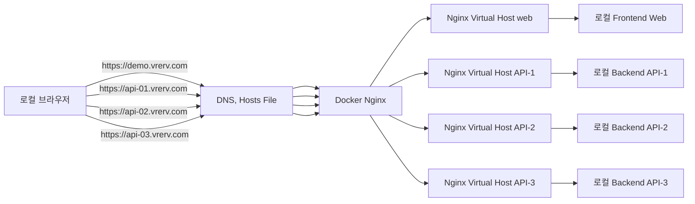

## 개요

로컬 개발환경에서 Self-Signed 인증서 사용 HTTPS를 적용해서 테스트 하고 싶을 때 사용할 수 있는 방법 이다.

특별한 사항에서 사용할 수 있다.

- 개발환경 설정이 안되어 로컬 구동시 운영환경으로 연결되는 경우에 서버 인증서를 로컬에 가져올 수 없는 경우
- 로컬에서 서버 https 를 접속하거나, 로컬 서버에 접속하는 것을 스위칭하고 싶을 경우

### 구성의 예



## 디렉토리 구조

현재 디렉토리 아래 아래 디렉토리를 구조로 만들어 관련 파일을 저장한다. docker 구동시 해당 디렉토리를 위치를 넘겨 구동하게 되므로,
만약 위치를 바꾸면 docker 구동시 옵션을 바꿔줘야 한다.

./ssl - self signed 인증서 저장
./nginx/conf.d - nginx virtual host 설정

## 인증서 생성

./ssl 아래에 인증서를 만든다.

인증서 생성시 openssl 을 사용한 명령을 직접 사용하면 되나, 편의를 위한 스크립트가 있으므로 해당 스크립트를 사용하여 생성할 수 있다.

```
git clone https://github.com/zablik/ssl_cert_generator.git
cd ssl_cert_generator
```

### 루트 인증서 생성

루트 인증서는 한번만 만들어 등록하면 된다.
```
./root_ca.sh
```

`../root` 아래에 인증서가 생성된 것으로 적절한 위치로 복사한다.

### 도메인 인증서 Common Name 으로 생성

```
./domain.sh vrerv.com "*.vrerv.com"
```

`../vrerv.com` 아래에 인증서가 생성된 것으로 적절한 위치로 복사한다.

## Hosts 파일 편집

hosts 파일에 다음 을 등록한다.

* Linux/Mac OS X - /etc/hosts 의 파일을 수정한다.
* Windows - C:/Windows/System32/drivers/etc/hosts 파일을 수정한다.
  * nodepad 등의 앱을 관리자 권한을 실행한다.
  * 파일 오픈 선택후 팝업에서 기본 ".txt" 파일만 선택되는 것을 "모든 파일" 을 볼수 있도록 필터를 조절한다.
  * hosts 파일을 연다. 아래 내용을 추가한다.

* 만약 특정 서버만 로컬로 보고 싶다면 예를 들어 백엔드중 api-1만 로컬로 보게 하고 싶다면, 다른 두 백엔드 서버는 "#" 으로 주석처리하면 된다.
* 만약 운영 도메인이 바뀌게 되면, 당연히 수정해서 등록해야 한다.

```
127.0.0.1       www.vrerv.com
127.0.0.1       api-1.vrerv.com
127.0.0.1       api-2.vrerv.com
127.0.0.1       api-3.vrerv.com
```

## Nginx 설치

* Docker 를 먼저설치한다. - Windows 의 경우 WSL 도 필수 설치한다.
* docker 로 nginx 를 구동한다.

docker nginx 컨테이너 안에서 컨테이너 밖의 서버들에 접속하기 위해서는 --add-host 를 통해 "localnode" 를 docker 에서 바라보는 ip 를 지정해줘야 한다.
이 ip 는 도커를 설치하면서 자동 설정되는 네트워크에 의해 결정되는데 리눅스/맥 과 윈도우즈는 해당 IP 를 찾는 방법이 조금 다르다.

Linux/Mac OS X 의 경우 아래와 같이 구동한다.
**아래 도커 명령은 pwd 명령을 사용함으로 현재 디렉토리가 위치가 아래에 ./nginx 디렉토리가 있어야 한다.**

도메인의 각 하위 서버는 nginx virtual host 로 개별 파일에 설정한다.

예를 들면, demo.vrerv.com 은 ./nginx/conf.d/demo.vrerv.com.conf 파일에 아래와 같이 설정한다.

```
server {
    listen 80;
    listen [::]:80;

    server_name demo.vrerv.com;

    return 301 https://$server_name$request_uri;
}

server {
    listen 443 ssl http2;
    listen [::]:443 ssl http2;

    server_name demo.vrerv.com;

    ssl_certificate /etc/nginx/ssl/vrerv.com.crt;
    ssl_certificate_key /etc/nginx/ssl/vrerv.com.key;

    location / {
        proxy_pass http://localnode:3000;
        proxy_set_header Host $host;
        proxy_set_header X-Real-IP $remote_addr;
        proxy_set_header X-Forwarded-For $proxy_add_x_forwarded_for;

        # WebSocket support
        proxy_http_version 1.1;
        proxy_set_header Upgrade $http_upgrade;
        proxy_set_header Connection "upgrade";
    }
}
```


```bash
docker run --rm --name nginx -d --add-host localnode:`ifconfig en0 | grep inet | grep -v inet6 | awk '{print \$2}'` -v `pwd`/nginx/conf.d:/etc/nginx/conf.d -v `pwd`/nginx/ssl:/etc/nginx/ssl -p 80:80 -p 443:443 nginx
```

Windows 에서는 WSL 콘솔 (Ubuntu 또는 다른 설치된 리눅스 배포판 이름으로 보이는 명령창) 에서 ifconfig 를 실행하여 나오는 ip 를 사용한다.
Windows 의 경우 WSL 콘솔 (Ubuntu 또는 다른 설치된 리눅스 배포판 이름으로 보이는 명령창) 로 다음을 실행한다.

```bash
docker run --rm --name nginx -d --add-host localnode:{IP를여기에입력} -v `pwd`/nginx/conf.d:/etc/nginx/conf.d -v `pwd`/nginx/ssl:/etc/nginx/ssl -p 80:80 -p 443:443 nginx
```

https://demo.vrerv.com  을 호출하면 모두 localhost 로 구동됨을 알 수 있다.
다만, 인증서가 오류가 날것이다. 따라서 아래 인증서 등록 과정을 해야 한다.

## 루트 인증서 OS 의 신뢰 저장소에 등록 (*..vrerv.com 도메인)

./ssl/rootCA.crt 를 아래와 같이 OS 의 신뢰된 루트 인증서 목록에 추가해야 한다.

* Mac OS X - 키체인을 구동 해당 인증서를 드래그해서 가져다 놓는다. 드롭된 인증서를 더블 클릭하여 항상 신뢰로 설정한다.
* Windows - ./ssl/rootCA.crt 를 더블 클릭한다. "인증서 설치" 누른다. "로컬 컴퓨터" 선택 후 다음. "모든 인증서를 다음 저장소에 저장" 선택후 "찾아보기" 에서 "신뢰할 수 있는 루트 인증 기관" 선택후 다음. "마침".

## Node 인증서 처리

* Node 에서는 루트 인증서를 OS 등록된 것을 사용하지 않는 것으로 보인다. 따라서 아마 SSR 로 서버사이드 호출시 인증서 에러가 날것이다. 해결법은 Node 자체 관리 저장소에 루트 인증서를 등록하면 되지만, 복잡함으로 그냥 인증서 검증 패스 옵션을 .env 에 설정한다.

```
# 인증서 유효성 검사 안함 - 개발시만 사용, 운영시 주석 처리
NODE_TLS_REJECT_UNAUTHORIZED=0
```

## 구동 확인

https://demo.vrerv.com 을 호출하면 모두 localhost 로 구동됨을 알 수 있다.
만약 서버 포트가 변경되면 conf.d/ 에 각 서버의 백엔드 virtual host 설정에서 포트를 바꿔줘야 한다. 물론 도메인 변경시도 마찬가지이다.

## 문제

안타깝게도 docker container 안에서 host pc 를 보는 ip 가 바뀔수도 있다.
만약 바뀌면 docker container 를 지우고 다시 띄워햐 한다. 지우고 다시 띄우기 위해 docker 구동시 --rm 옵션을 줘서 docker kill시 자동으로 컨텥이너 삭제가 되도록 하는 편이 좋다.
